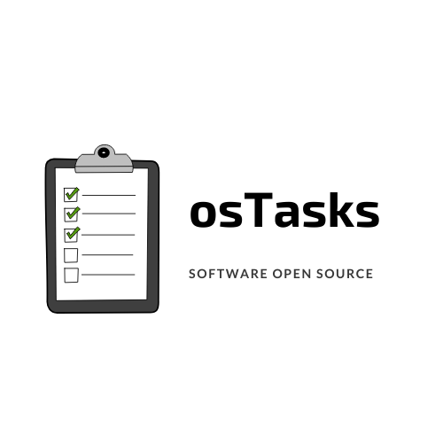

# osTasks

<!---Esses são exemplos. Veja https://shields.io para outras pessoas ou para personalizar este conjunto de escudos. Você pode querer incluir dependências, status do projeto e informações de licença aqui--->




> Esse é um projeto hipotético para a disciplina de Desenvolvimento de Software Livre. Com o intuito de exemplificar a criação e manutenção de um projeto livre entre pessoas de diferentes regiões.

### Ajustes e melhorias

O projeto ainda está em desenvolvimento e as próximas atualizações serão voltadas nas seguintes tarefas:

- [x] Criar repositório
- [x] Criar servidor no Discord
- []  X
- []  Y

## 💻 Pré-requisitos

Antes de começar, verifique se você atendeu aos seguintes requisitos:
<!---Estes são apenas requisitos de exemplo. Adicionar, duplicar ou remover conforme necessário--->
* Servidor Apache
* PHP versão 7.2 a 7.4, 7.4 é recomendado
* extensão mysqli para PHP
* Banco de dados MySQL versão 5.5


## 🚀 Instalando osTasks

Para instalar o <osTasks>, siga estas etapas:

1) Clonar o repositório:
```
git clone https://github.com/andrelisen/osTasks-dsl.git
```

2) Implementar o código na raíz do projeto na pasta www, por exemplo:
```
cd osTasks
php manage.php deploy --setup /var/www/htdocs/osTasks/
```


## 📫 Contribuindo para <osTasks>
<!---Se o seu README for longo ou se você tiver algum processo ou etapas específicas que deseja que os contribuidores sigam, considere a criação de um arquivo CONTRIBUTING.md separado--->
Para contribuir com <osTasks>, siga estas etapas:

1. Bifurque este repositório.
2. Crie um branch: `git checkout -b <nome_branch>`.
3. Faça suas alterações e confirme-as: `git commit -m '<mensagem_commit>'`
4. Envie para o branch original: `git push origin <nome_do_projeto> / <local>`
5. Crie a solicitação de pull. 

Como alternativa, consulte a documentação do GitHub em [como criar uma solicitação pull](https://help.github.com/en/github/collaborating-with-issues-and-pull-requests/creating-a-pull-request).


## 😄 Seja um dos contribuidores<br>

Quer fazer parte desse projeto? Verifique as issues disponíveis.

Para se comunicar com os outros colaboradores, entre no nosso servidor do Discord [AQUI](https://discord.gg/7K4jdkPr).

## 📝 Licença

Esse projeto está sob licença GNU Public License v3.0 . Veja o arquivo [LICENÇA](LICENSE.md) para mais detalhes.

[⬆ Voltar ao topo](#osTasks)<br>
